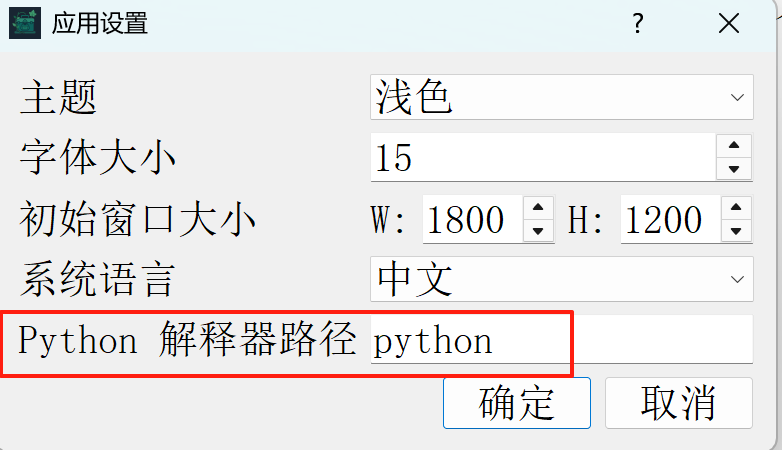

# README

> 这是一款基于PyQt5的工具管理平台，用于集中管理本地可执行程序、命令行工具和常用工具网站，并提供使用说明、分类管理与数据统计等功能
> 目的：让每个网安人都能有属于自己的工具箱！！！


## 一、创作原因

在网络安全的学习过程中，我们经常需要在本地执行各种可执行程序、命令行工具或频繁访问各类网站与文档，但工具与网址分散在不同目录、书签和终端标签中，**既难以快速定位，又会因为工具众多而忘记工具的作用**。

**为了解决上述痛点，IvyDock应运而生**

**本项目的目标是：让每个网安人都能有属于自己的工具箱！**

## 二、基本使用动画

### 1、添加工具：


### 2、使用工具：


## 三、核心功能介绍

- ✅ **工具统一管理**
   支持添加/编辑/删除工具，支持五种类型：

  - 网站（Website）
  - 命令行工具（CLI Tool）
  - 可执行程序（Executable）
  - 命令行Python工具（Python CLI Tool）
  - 可执行Python工具（Python Executable）

- ✅ **分类与搜索**
   支持自定义工具分类，快速搜索工具名称或分类关键词

- ✅ **说明文档支持**
   每个工具可绑定 Markdown/Text/PDF 格式的说明文档，支持自动打开阅读

  

- ✅ **个性化配置**
   提供界面设置选项，包括：

  - 明亮/暗黑/跟随系统主题
  - 字体大小
  - 初始窗口尺寸
  - 应用语言（简体中文 / English）
  - Python 解释器路径（用于运行 Python 工具）

- ✅ **使用日志与仪表盘**
   自动记录工具使用记录，生成：

  - 今日使用 Top5 工具柱状图
  - 最近 7 天 / 30 天使用趋势折线图

## 四、使用指南

> ✅简单安装一下环境：
>
> （1）首先确保你有python的环境（我使用的是最新版本）
>
> （2）下载项目压缩包
>
> （3）解压后，在项目目录打开cmd，然后输入：
>
> ```cmd
> pip install -r requirements.txt
> ```
>
> 即可安装项目所需的库
>
> （4）然后输入：
>
> ```cmd
> python IvyDock.py
> ```
>
> 即可打开本项目

------

#### 1、启动程序

- 首次启动后，系统会自动在当前目录生成：
  - `settings.json`（用于保存用户配置）
  - `tools_data.json`（用于保存工具信息）
  - `usage_log.json`（用于记录工具使用情况）

------

#### 2、添加工具

点击界面左上角按钮「+ 添加工具」，弹出添加工具对话框：

- **工具类型**（必须选择）：

  - 🌐 网站：如 FOFA、ZoomEye、SRC 等网页入口
  - ⚙️ 命令行工具：如 nmap、sqlmap、ffuf 等可在终端运行的工具
  - 🖥 可执行程序：如 BurpSuite.exe、Wireshark.exe 等 GUI 工具
  - 🐍 命令行 Python 工具：如 `recon.py` 等 Python 脚本型工具（终端交互）
  - 🐍 可执行 Python 工具：如用 Tkinter、PyQt 编写的 GUI 工具

- **字段填写说明**：

  | 字段        | 说明                                                |
  | ----------- | --------------------------------------------------- |
  | 名称        | 显示在工具列表中的名称                              |
  | 类型        | 工具的运行类型（见上）                              |
  | 路径 / 网址 | 可执行程序或脚本文件路径，或网页地址                |
  | 参数        | 可选。传递给工具的默认启动参数                      |
  | 分类        | 自定义分类（如“信息收集”、“漏洞利用”等）            |
  | 说明文档    | 支持 `.md`、`.txt`、`.pdf` 文件，可用于展示使用说明 |
  | 描述        | 对该工具的功能简要说明                              |

  

点击「确定」后，工具将自动保存并显示在左侧分类列表中。

------

#### 3、使用工具

- 在工具列表中，**双击任意工具**即可启动：
  - 网站：自动在默认浏览器中打开网址
  - CLI工具：打开内置命令行窗口，自动执行并显示输出
  - 可执行程序：自动在系统中运行工具（等同于双击）
  - Python工具：根据类型使用用户指定的解释器运行 `.py` 脚本
- **如配置了说明文档，会在启动工具时自动打开阅读文档。**

------

#### 4、搜索与分类

- 顶部搜索框支持模糊搜索工具名称与分类，实时筛选结果。
- 工具按照用户定义的「分类」自动归组显示，便于模块化管理。

------

#### 5、设置应用参数（主题 / 字体 / 语言）

点击左上角菜单 → 选择「应用设置」可进行界面自定义：


- **主题模式**：浅色 / 暗黑 / 跟随系统
- **字体大小**：调节界面字号大小
- **窗口尺寸**：设置初始宽高
- **语言**：支持简体中文 / English
- **Python 解释器路径**：
  - 用于执行 Python 类型工具（可填如 `python3.10`、`C:/Python39/python.exe`）（如果使用的是环境变量中指定的python，则保持默认即可）
  - 

更改后将提示你是否立即重启以生效。

------

#### 6、查看使用统计（仪表盘）

切换到顶部「近期工具使用情况」页面，可查看你的使用数据：

- 📊 **今日 TOP5 工具**：按使用频率排名，展示柱状图
- 📈 **近 7 日 / 30 日趋势**：展示你的活跃周期和工具使用频率

这个功能可以帮你精炼你的工具库哦~

------

## 五、提醒（建议要看！！！）

1. **建议创建两个文件夹（tools和instructions）方便管理工具和工具介绍说明书**
2. **在添加工具到本项目之前，先确保该工具原本就可以正常使用**
3. **如果在添加工具中使用过“默认参数”：**

   比如你在添加“fscan”工具的时候设置了默认参数-h：

   

   则就相当于cmd中默认就写好了：

   ```
   fscan.exe <你写的默认参数>
   ```

   然后你只需要在跳出来的“命令工具运行”中继续填写后面的部分就好了

   比如：

   