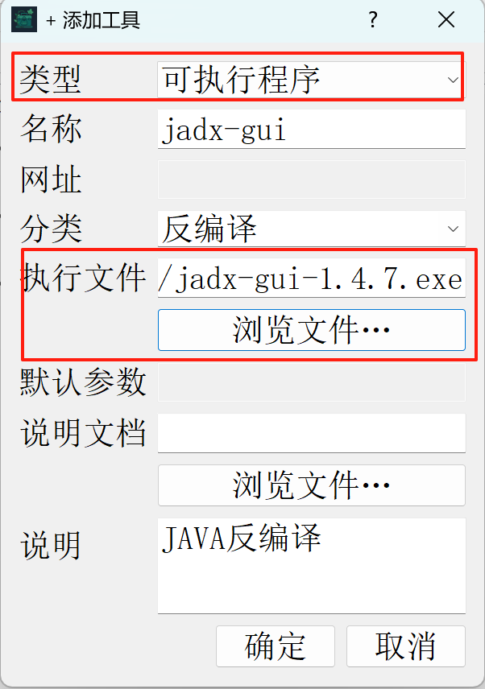

# README

> 这是一款基于PyQt5的工具管理平台，用于集中管理本地可执行程序、命令行工具和常用工具网站，并提供使用说明、分类管理与数据统计等功能


## 一、创作原因

在网络安全的学习过程中，我们经常需要在本地执行各种可执行程序、命令行工具或频繁访问各类网站与文档，但工具与网址分散在不同目录、书签和终端标签中，**既难以快速定位，又会因为工具众多而忘记工具的作用**。

**为了解决上述痛点，IvyDock应运而生**

## 二、核心功能与使用方法

### 1、多类型工具管理

支持Website(网站工具)、CLI(命令行工具)、Executable(可执行程序：.exe .py)**三种类型的工具**

**且支持“说明文档”的绑定**，**即打开工具的同时也会打开绑定好的说明文档**


根据自己喜好集成到本工具之中，方便日后的使用

**接下来介绍如何添加工具：**

#### （1）网站类型的工具


> [!NOTE]
>
> 说明文档类型支持格式：.md、.txt
>
> 可在右下方选则：
>
> 

配置好上述参数后，点击确定即可创建该工具

**创建完成后，单击工具，就可以看到刚刚配置的相关信息**


左上角的：


点击后可以折叠左边的部分，效果：


**双击工具，即可打开工具/网站，如果指定了说明文档，那么同时也会打开说明文档**

**右键工具可以选则“删除工具”、“编辑工具”**

#### （2）命令行类型的工具

大体内容同上，**讲一下不一样的：**


- 类型需要选则“命令行工具”
- 执行文件：需要定位到你要的工具的.exe或.py文件
- 默认参数可选，后面讲

拿fscan工具举例子：

双击添加好的工具后，会出现“命令行工具运行”


在上面输入工具要的参数就好了，如上图，**上图的效果就相当于cmd中输入**：

```cmd
fscan.exe -h 10.91.1.1/24
```

执行效果：


就和你在命令行直接使用一样

> [!NOTE]
>
> **如果在添加工具中使用过“默认参数”：**
>
> 比如你设置了默认参数-h：
>
> 
>
> 则就相当于cmd中默认就写好了：.exe <你写的默认参数>
>
> 然后你只需要在跳出来的“命令工具运行”中继续填写后面的部分就好了
>
> 比如：
>
> 

#### （3）可执行程序类型的工具

大体内容同上，**讲一下不一样的：**



- 类型需要选则“可执行程序”
- 执行文件需要选中该可执行程序的.exe或者.py文件

**其他使用过程和前面类似**

### 2、支持工具搜索


可支持类别搜索、工具名搜索

### 3、近期工具使用情况


可查看近期工具的使用情况，便于然后精炼你的个人工具库

### 4、其他

#### （1）应用设置


可自定义：


- 主题支持：浅色、暗黑、随系统
- 字体大小
- 初始窗口大小
- 系统语言支持：中文、英文

#### （2）支持调整左右窗口大小


将鼠标放到中间分割线，即可拖动来调整左右窗口大小，效果：


#### （3）可通过滚轮调整右侧显示内容大小

鼠标滑动到右侧，然后“ctrl + 滚轮”即可调整字体

效果：


## 三、安装与打开

（1）下载项目压缩包

（2）确保你有python的环境（我使用的是最新版本）

（3）解压后，在项目目录打开cmd，然后输入：

```cmd
pip install -r requirements.txt
```

即可安装项目所需的库

> [!NOTE]
>
> pip安装失败的可以根据报错信息上网查资料
>
> 不过基本上就是因为py的库在国外，国内下载慢，建议pip换源（网上有资料）或者直接科学上网

（4）然后输入：

```cmd
python IvyDock.py
```

即可打开本项目

## 四、提醒（建议要看！！！）

1. **建议创建两个文件夹（tools和instructions）方便管理工具和工具介绍说明书**
2. **在添加工具到本项目之前，先确保该工具原本就可以正常使用**